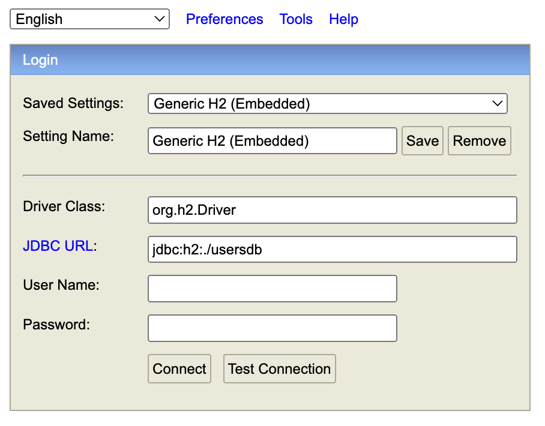
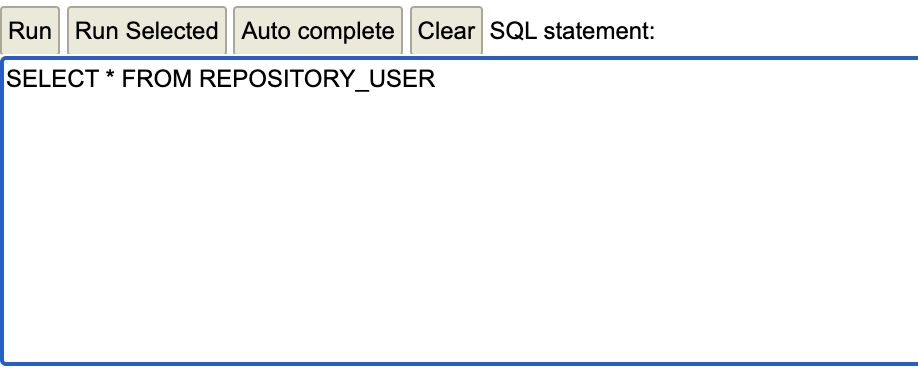
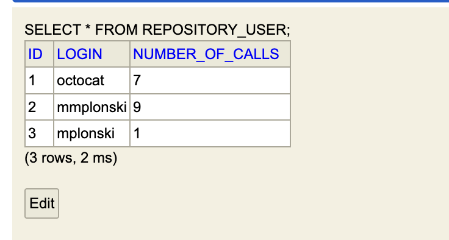

# requestCountApp
## Krótki opis
Jest to aplikacja do która pobiera dane z https://api.github.com/users/{login}.
Aplikacja została napisana w Javie 17, za pomocą SpringBoot.
Przed uruchomieniem, sprawdź czy posiadasz taką wersje javy.
Aplikacja korzysta z bazy danych H2.
## Uruchomienie
Przed uruchomieniem należy upewnić się, że na porcie 8080 nie działa inna aplikacja Javowa.
Aplikację możną uruchomić na dwa sposoby:
1. Za pomocą środowiska programistycznego, preferowany InteliJ IDEA
Należy sklonować projekt https://github.com/mmplonski/requestCountApp
2. Dla systemów Linux/MacOS
  Należy pobrać plik requestCountApp.jar, w terminalu przejsc do lokalizacji w której się znajduje i wpisać polecenie
java -jar requestCountApp.jar
  
## Założenia
1. Użytkownik pobierany jest z https://api.github.com/users/{login}. .
2. Jeśli użytkownik nie istnieje wyświetlony zostanie komunikat
   "Nie znaleziono podanego użytkownika". Jeśli użytkownik istnieje to zostaną zwrócone informację dotyczącego tego użytkownika.
3. Każde poprawne pobranie użytkownika jest zapisywane w bazie danych w postaci login, liczba_request.
4. Jeśli liczba followers będzie równa 0 to calculations również będzię 0. 

## Komunikacja z aplikacją 
### Pobranie użytkownika o danym loginie
 GET http://localhost:8080/users/{login}

login - login użytkownika którego chcemy pobrac 
 
 Przykładowe zapytanie i odpowiedz :
 GET http://localhost:8080/users/{octocat}
```
{
    "id": 583231,
    "login": "octocat",
    "name": "The Octocat",
    "type": "User",
    "calculations": 0.0000627878,
    "followers": 9556,
    "avatar_url": "https://avatars.githubusercontent.com/u/583231?v=4",
    "created_at": "2011-01-25T18:44:36Z",
    "public_repos": 8
}
```
### Weryfikacja zapisu do danych
W celu zweryfikowania tego czy login i liczba requestow jest zapisywana do bazy danych należy w przeglądarce wpisac
http://localhost:8080/h2-console
Następnie połączyć się z bazą danych

Wpisać nastepujące zapytanie SQL i kliknąć RUN 

Tu widać rekordy zapisany w bazie danych


